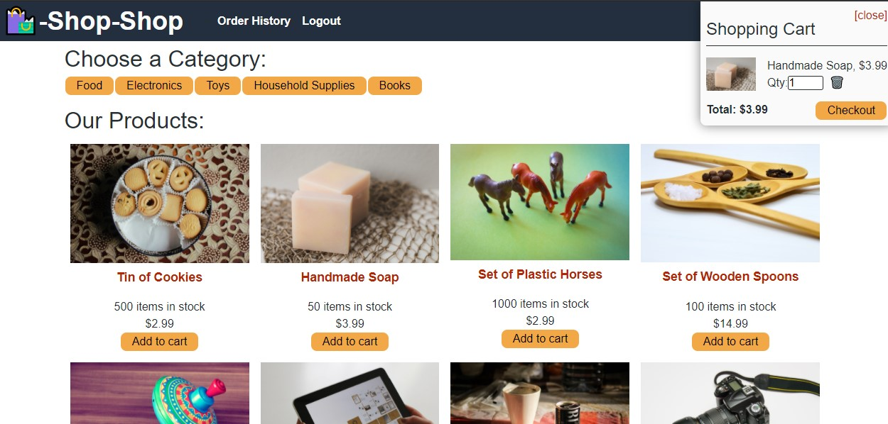

# Shop-shop

## Deascription
A ecomerce react redex web application.

## Table of Contents
- [Description](#description)
- [User Story](#user-story)
- [Acceptance Criteria](#acceptance-criteria)
- [Screenshots](#screenshots)
- [Author](#author)
- [Website](#website)

## User Story

## Acceptance Criteria
* As a user, I want to experience better performance across the features I use in the application:
  * View and filter products by category
  * Click on a product to see full details
* As a user, I want to be able to see my shopping cart from any page
* As a user, I want to be able to update or delete the quantity of shopping cart items
* As a user, I want to be able to persist my current shopping cart items if I close the browser tab
* As a user, I want to be able to view and add products to my shopping cart with or without a network connection
* As a user, I would like to be able to use my credit card to process and complete my order
* As a user, I want to see my order history

## Screenshots

## Website
"https://shop-97261.herokuapp.com/"

## Author
* [Ann-Marie Orozco](ann760.github.io/developer-portfolio/) follow the link to see my portfilo website
* [Ann-Marie's git repository](https://github.com/ann760)